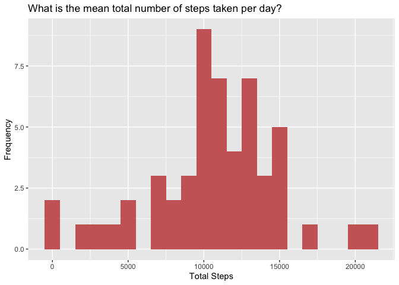
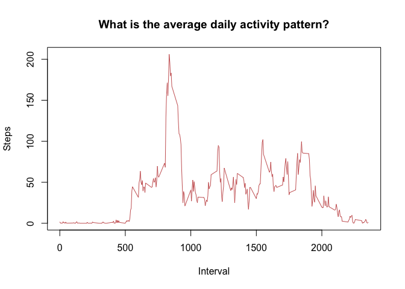
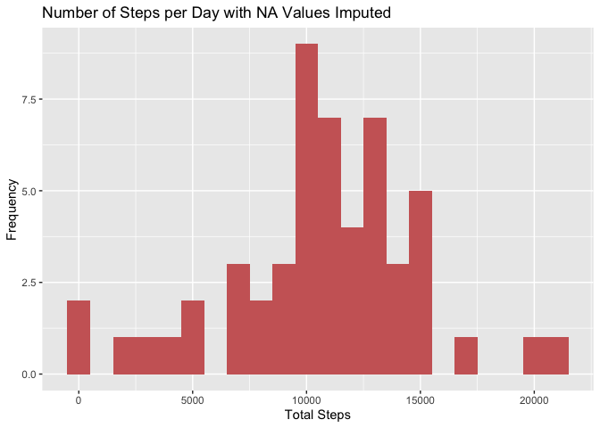
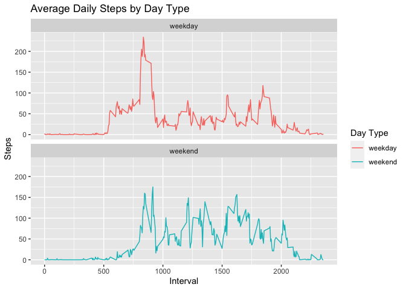

## Introduction
It is now possible to collect a large amount of data about personal movement using activity monitoring devices such as a Fitbit, Nike Fuelband, or Jawbone Up. These type of devices are part of the “quantified self” movement – a group of enthusiasts who take measurements about themselves regularly to improve their health, to find patterns in their behavior, or because they are tech geeks. But these data remain under-utilized both because the raw data are hard to obtain and there is a lack of statistical methods and software for processing and interpreting the data.

This assignment makes use of data from a personal activity monitoring device. This device collects data at 5 minute intervals through out the day. The data consists of two months of data from an anonymous individual collected during the months of October and November, 2012 and include the number of steps taken in 5 minute intervals each day.

The data for this assignment can be downloaded from the course web site:

Dataset: [Activity monitoring data](https://d396qusza40orc.cloudfront.net/repdata%2Fdata%2Factivity.zip) [52K]

The variables included in this dataset are:

steps: Number of steps taking in a 5-minute interval (missing values are coded as red) </br>
date: The date on which the measurement was taken in YYYY-MM-DD format</br>
interval: Identifier for the 5-minute interval in which measurement was taken</br>

The dataset is stored in a comma-separated-value (CSV) file and there are a total of 17,568 observations in this dataset.

## Loading data and dependencies

Load the data (i.e. read.csv()). </br>
Process/transform the data (if necessary) into a format suitable for your analysis.


```r
# Required dependencies and initial file prep
library(ggplot2)
library(lubridate)
```

```
## 
## Attaching package: 'lubridate'
```

```
## The following objects are masked from 'package:base':
## 
##     date, intersect, setdiff, union
```

```r
library(dplyr)
```

```
## 
## Attaching package: 'dplyr'
```

```
## The following objects are masked from 'package:stats':
## 
##     filter, lag
```

```
## The following objects are masked from 'package:base':
## 
##     intersect, setdiff, setequal, union
```

```r
filename <- "repdata_data_activity.zip"

# Checking for downloaded archive

if (!file.exists(filename)){
  fileURL <- "https://d396qusza40orc.cloudfront.net/repdata%2Fdata%2Factivity.zip"
  download.file(fileURL, filename, method="curl")
}  

# Checking for unzipped folder 

if (!file.exists("activity.csv")) { 
  unzip(filename) 
}
```

## Create data frames


```r
fitness_data <- read.csv("activity.csv")
head(fitness_data)
```

```
##   steps       date interval
## 1    NA 2012-10-01        0
## 2    NA 2012-10-01        5
## 3    NA 2012-10-01       10
## 4    NA 2012-10-01       15
## 5    NA 2012-10-01       20
## 6    NA 2012-10-01       25
```

```r
# Reformat and check date column 

fitness_data$date <- ymd(fitness_data$date)
str(fitness_data)
```

```
## 'data.frame':	17568 obs. of  3 variables:
##  $ steps   : int  NA NA NA NA NA NA NA NA NA NA ...
##  $ date    : Date, format: "2012-10-01" "2012-10-01" ...
##  $ interval: int  0 5 10 15 20 25 30 35 40 45 ...
```

## Question 1 - What is mean total number of steps taken per day?

Calculate the total number of steps taken per day.


```r
total <- aggregate(steps~date, data=fitness_data, sum, na.rm = TRUE)
```

If you do not understand the difference between a histogram and a barplot, research the difference between them. Make a histogram of the total number of steps taken each day.


```r
# Histogram - Plot 1

ggplot(total, aes(x = steps)) + geom_histogram(fill = "#cc6666", binwidth = 1000) + labs(title = "What is the mean total number of steps taken per day?",x = "Total Steps", y = "Frequency")
```

<!-- -->

Calculate and report the mean and median of the total number of steps taken per day.


```r
mean(total$steps)
```

```
## [1] 10766.19
```

```r
median(total$steps)
```

```
## [1] 10765
```

```r
summary(total$steps)
```

```
##    Min. 1st Qu.  Median    Mean 3rd Qu.    Max. 
##      41    8841   10765   10766   13294   21194
```

## What is the average daily activity pattern?

Make a time series plot (i.e. 𝚝𝚢𝚙𝚎 = "𝚕") of the 5-minute interval (x-axis) and the average number of steps taken, averaged across all days (y-axis).


```r
# Time series plot - Plot 2
avg_steps <- aggregate(steps~interval, data=fitness_data, mean)

with(avg_steps, plot(interval, steps, type = "l", col = "#cc6666", main = "What is the average daily activity pattern?", ylab ="Steps", xlab ="Interval"))
```

<!-- -->

Which 5-minute interval, on average across all the days in the dataset, contains the maximum number of steps?


```r
#  5-min interval with max number of steps

avg_steps[which.max(avg_steps[,2]),1]
```

```
## [1] 835
```

## Imputing missing values

Calculate and report the total number of missing values in the dataset (i.e. the total number of rows with 𝙽𝙰s).


```r
sum(is.na(fitness_data$steps))
```

```
## [1] 2304
```

Devise a strategy for filling in all of the missing values in the dataset. The strategy does not need to be sophisticated. For example, you could use the mean/median for that day, or the mean for that 5-minute interval, etc. </br>

Create a new dataset that is equal to the original dataset but with the missing data filled in.


```r
# Create new data frame and use interval mean to fill in for NA values

missing_fitness_data <- is.na(fitness_data$steps)
interval_mean <- mean(avg_steps$steps)
new_fitness_data <- fitness_data
new_fitness_data["missing_fitness_data$steps"] <- interval_mean
head(new_fitness_data)
```

```
##   steps       date interval missing_fitness_data$steps
## 1    NA 2012-10-01        0                    37.3826
## 2    NA 2012-10-01        5                    37.3826
## 3    NA 2012-10-01       10                    37.3826
## 4    NA 2012-10-01       15                    37.3826
## 5    NA 2012-10-01       20                    37.3826
## 6    NA 2012-10-01       25                    37.3826
```

```r
# Total steps per day w/ NA values imputed 

total_new <- aggregate(steps~date, data = new_fitness_data, sum)

# Checking for any missing values, should equal 0

sum(is.na(total_new$steps))
```

```
## [1] 0
```

Make a histogram of the total number of steps taken each day and Calculate and report the mean and median total number of steps taken per day. Do these values differ from the estimates from the first part of the assignment? What is the impact of imputing missing data on the estimates of the total daily number of steps?


```r
# Histogram - Plot 3

ggplot(total_new, aes(x = steps)) + geom_histogram(fill = "#cc6666", binwidth = 1000) + labs(title = "Number of Steps per Day with NA Values Imputed",x = "Total Steps", y = "Frequency")
```

<!-- -->

```r
# Calculate mean and median of total steps per day and check results

mean(total_new$steps)
```

```
## [1] 10766.19
```

```r
median(total_new$steps)
```

```
## [1] 10765
```

```r
summary(total_new$steps)
```

```
##    Min. 1st Qu.  Median    Mean 3rd Qu.    Max. 
##      41    8841   10765   10766   13294   21194
```

There was no change from the prior mean and median values. 

## Are there differences in activity patterns between weekdays and weekends?

Create a new factor variable in the dataset with two levels – “weekday” and “weekend” indicating whether a given date is a weekday or weekend day.


```r
# New factor variable w/ 2 levels - “weekday” and “weekend”

weekday <- function(date){
        if(wday(date) %in% c(1,7)) 
	result <- "weekend"
        else 
        result <-"weekday"
}

new_fitness_data <- mutate(new_fitness_data, date = ymd(date)) %>% 
mutate(day = sapply(date, weekday))

# Check levels

table(new_fitness_data$day)
```

```
## 
## weekday weekend 
##   12960    4608
```

Make a panel plot containing a time series plot (i.e. type = "l") of the 5-minute interval (x-axis) and the average number of steps taken, averaged across all weekday days or weekend days (y-axis). 


```r
# Calculate average number of steps, averaged across all weekday days or weekend days

new_fitness_data_DT <- aggregate(steps ~ interval + day, new_fitness_data, mean, na.rm = TRUE)

# Panel plot with a time series plot - Plot 4

ggplot(new_fitness_data_DT, aes(x = interval , y = steps, color = day)) + 
    geom_line() + ggtitle("Average Daily Steps by Day Type") + 
    xlab("Interval") + 
    ylab("Steps") +  facet_wrap(~day, ncol = 1,nrow = 2) + scale_color_discrete(name = "Day Type")
```

<!-- -->

